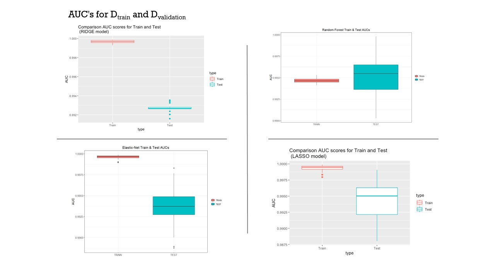
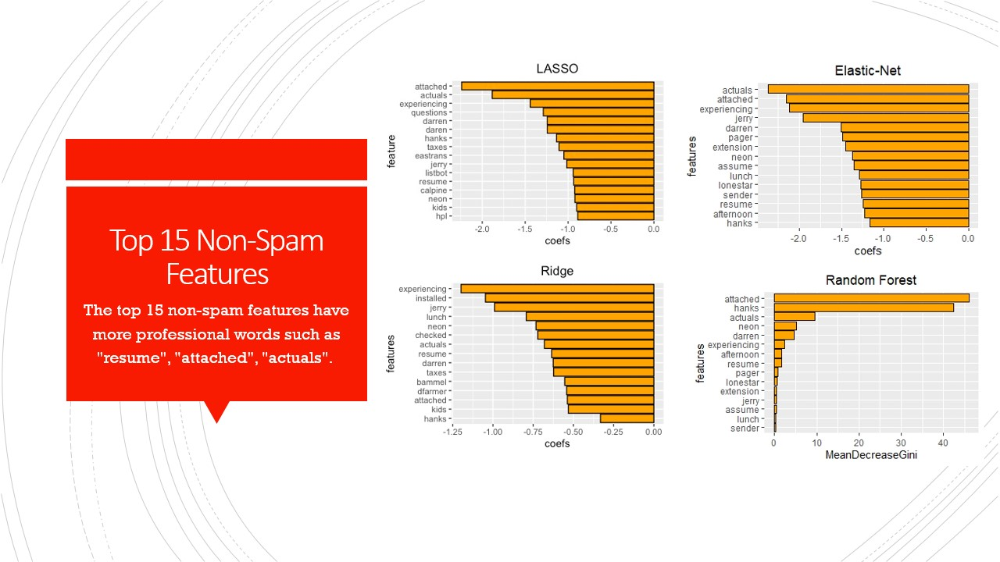

# STA9891-spam
Classifying spam vs non spam emails, using LASSO, RIDGE, ELNET and Random Forest

## Model Performance vs. Time to Train
No significant tradeoff in model performance and time required to train/fit the model

## Feature importance comparison across Models
Features are ordered according to estimated coefficient values (in descending order) based on the Elastic-Net model

Thank you for your time and attention